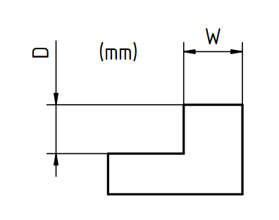
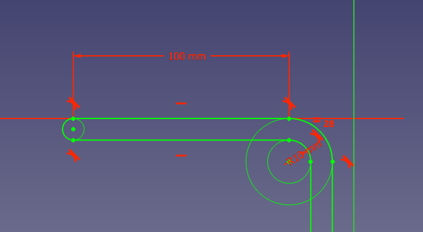
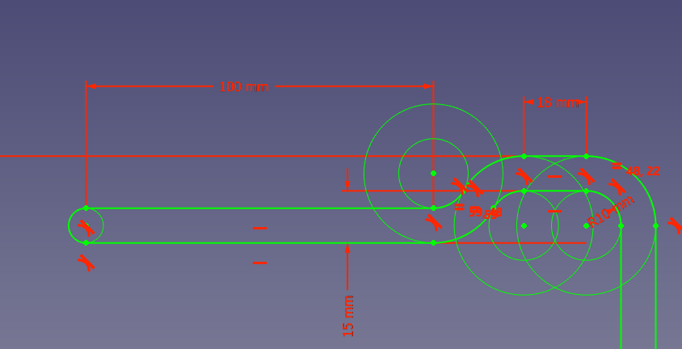

# e-reader-or-book-bed-holder
Open source 3D printable holder for e-readers or books. Attachable to a bed

Designed for personal use and remixing — see license details below for commercial terms.

This design is inspired by the [Kindle / Ebook Holder for Ikea Bed Frames](https://www.printables.com/model/1387947-kindle-ebook-holder-for-ikea-bed-frames) by [@Franks3y_2334152](https://www.printables.com/@Franks3y_2334152) on printables.

## 🧩 What's Included

- 3D models designed in Freecad
- stl file
- This README and LICENSE.txt

## Sizes

If your bed has an edge at the end and is not flat then use a size that fits your bed.
They are given in millimeters and are in the format:
> `book_or_kindle_bed_holder_W#_D#`
Where W is the width of the edge and D is the depth from the edge to where the bed frame holds the mattress.
The extension of the holder always goes 100mm in from the same point, see the images below.

If the size you want is missing then you can request it by [submitting an issue here](https://github.com/G0rocks/e-reader-or-book-bed-holder/issues/new/choose)

## 📜 License

This project is licensed under the **Creative Commons Attribution-NonCommercial-ShareAlike 4.0 International (CC BY-NC-SA 4.0)** license **with a Commercial Exception**.
This means you can:
- Download and print it for yourself.
- Remix and share modified versions as long as you keep it under the same license.
- Use it for educational or personal projects.

**You cannot:**
- Sell the printed model or any derivative commercially **without first contacting me the original creator**.

### 📞 Commercial Use

If you'd like to sell this model (or a remix), please reach out first to request a commercial license by opening a discussion [here](https://github.com/G0rocks/e-reader-or-book-bed-holder/discussions/categories/commercial-license-request)

Each request will be handled individually.

## 🛠 Contributing

Feel free to open [issues](https://github.com/G0rocks/e-reader-or-book-bed-holder/issues) for bugs, feature requests, or improvements. Pull requests welcome!

## ❤️ Credits

Designed by G0rocks
Licensed under CC BY-NC-SA 4.0 + Commercial Exception  
Full license in `LICENSE.txt`

---
